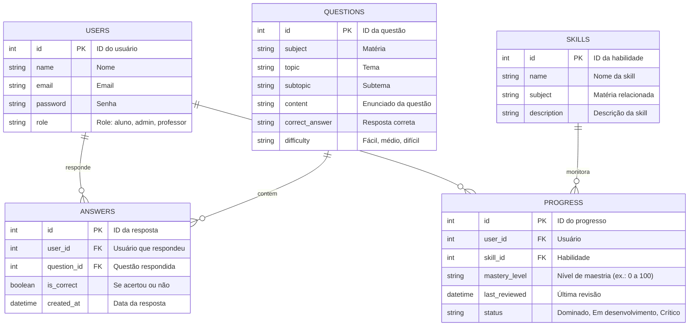

# 🚀 MentorIA – Frontend

## Projeto desenvolvido para Disciplina de Engenharia de Software da Universidade Federal de Pernambuco.

Frontend da plataforma MentorIA, um tutor digital que identifica suas dificuldades, gera trilhas de treino personalizadas e te guia até o domínio completo das competências para ENEM, podendo ser expandido para trilhas diferentes como ITA, IME, concursos e aprendizados variados, como computação.

Nossa demonstração almeja fazer uma prova de conceito a partir das questões de matemática do enem.

> ✅ Este repositório corresponde **ao frontend.** O backend está disponível [aqui](https://github.com/luanromancin/mentorIA-Backend).

---

## 📄 Descrição Geral

A proposta é transformar a forma como estudantes identificam seus pontos fortes e fracos, utilizando tecnologia, IA e gamificação para acelerar seu progresso.

## 🎯 Funcionalidades Principais Almejadas

- 📊 Dashboard de desempenho
- 🧠 Teste diagnóstico com análise de domínio
- 🎯 Trilhas inteligentes de estudo
- 🔄 Revisão inteligente baseada na curva do esquecimento
- 🔐 Sistema de autenticação e perfis
- 📱 Design responsivo e acessível
- 🏆 Gamificação com XP, conquistas e rankings
- 🚀  ⁠Aplica revisão inteligente (spaced repetition) para retenção eficiente.

---

## 🗂️ Estrutura do Código

```plaintext
├── app/                # Rotas e páginas (App Router Next.js)
├── components/         # Componentes reutilizáveis
├── lib/                # Hooks, funções auxiliares e integrações
├── public/             # Arquivos públicos (imagens, favicon, etc.)
├── styles/             # Estilos globais e temas
├── types/              # Tipagens TypeScript
├── .env.example        # Template de variáveis de ambiente
├── README.md           # Documentação principal
├── BUILD.md            # Guia de execução local e deploy
├── CONTRIBUTING.md     # Guia para contribuição no projeto
└── package.json        # Dependências e scripts
```

## 🏗️ Stack de Tecnologias

| Camada       | Tecnologias                              |
|----------------|-------------------------------------------|
| *Frontend*  | Node.js + TypeScript (Framework como Next.js ou Vite) |
| *Backend*   | Node.js + Express + Prisma + TypeScript  |
| *Banco*     | PostgreSQL (Hospedado na nuvem — Railway ou Neon) |
| *Infraestrutura* | Railway (Backend + DB) + Vercel (Frontend) ou outro |
| *Gestão*    | GitHub Projects (Kanban e gestão ágil)   |

---

## 🔗 Diagrama C4 — Nível Container


---

## 🗄️ Diagrama ER — Banco de Dados MentorAI

Este diagrama representa o modelo relacional do banco de dados do MentorIA.  
Ele define como os usuários, questões, respostas, habilidades e progresso estão relacionados.



## 👥 Equipe

Gabriela Lima Sotero [Github] https://github.com/gabrielalimasotero
Luan Romancini [Github] https://github.com/Luanromancin
Antonio Gabriel [Github] https://github.com/gabrielclemnt
Wilton Sales [Github] https://github.com/WilSales

---

## 🔗 MockUp and PitchDeck

https://mentor-ia-learn.lovable.app/


