<a href="https://precedent.dev">
  
  <h1 align="center">Precedent</h1>
</a>

<p align="center">
  Building blocks for your Next project
</p>

<p align="center">
  <a href="https://twitter.com/steventey">
    
  </a>
  <a href="https://github.com/steven-tey/precedent">
    
  </a>
</p>

<p align="center">
  <a href="#introduction"><strong>Introduction</strong></a> ·
  <a href="#one-click-deploy"><strong>One-click Deploy</strong></a> ·
  <a href="#tech-stack--features"><strong>Tech Stack + Features</strong></a> ·
  <a href="#author"><strong>Author</strong></a>
</p>
<br/>

## Introduction

Precedent is an opinionated collection of components, hooks, and utilities for your Next.js project.

## One-click Deploy

You can deploy this template to Vercel with the button below:

[](https://vercel.com/new/clone?repository-url=https%3A%2F%2Fgithub.com%2Fsteven-tey%2Fprecedent&project-name=precedent&repository-name=precedent&demo-title=Precedent&demo-description=An%20opinionated%20collection%20of%20components%2C%20hooks%2C%20and%20utilities%20for%20your%20Next%20project.&demo-url=https%3A%2F%2Fprecedent.dev&demo-image=https%3A%2F%2Fprecedent.dev%2Fopengraph-image&env=NEXT_PUBLIC_CLERK_PUBLISHABLE_KEY,CLERK_SECRET_KEY&envDescription=Create%20a%20Clerk%20application%20to%20get%20these%20variables%3A&envLink=https%3A%2F%2Fdashboard.clerk.com%2Fapps%2Fnew)

You can also clone & create this repo locally with the following command:

```bash
npx create-next-app precedent --example "https://github.com/steven-tey/precedent"
```

Then, install the dependencies with your package manager of choice:

```bash
npm i
yarn
pnpm i
```

## Tech Stack + Features

https://github.com/user-attachments/assets/aef3c099-e371-43bf-b426-f5ba73185a7c

### Frameworks

- [Next.js](https://nextjs.org/) – React framework for building performant apps with the best developer experience
- [Clerk](https://go.clerk.com/precedent) - A comprehensive user management platform with beautifully designed, drop-in React components

### Platforms

- [Vercel](https://vercel.com/) – Easily preview & deploy changes with git

### UI

- [Tailwind CSS](https://tailwindcss.com/) – Utility-first CSS framework for rapid UI development
- [Radix](https://www.radix-ui.com/) – Primitives like modal, popover, etc. to build a stellar user experience
- [Framer Motion](https://framer.com/motion) – Motion library for React to animate components with ease
- [Lucide](https://lucide.dev/) – Beautifully simple, pixel-perfect icons
- [`next/font`](https://nextjs.org/docs/basic-features/font-optimization) – Optimize custom fonts and remove external network requests for improved performance
- [`ImageResponse`](https://nextjs.org/docs/app/api-reference/functions/image-response) – Generate dynamic Open Graph images at the edge

### Hooks and Utilities

- `useIntersectionObserver` –  React hook to observe when an element enters or leaves the viewport
- `useLocalStorage` – Persist data in the browser's local storage
- `useScroll` – React hook to observe scroll position ([example](https://github.com/steven-tey/precedent/blob/main/components/layout/navbar.tsx#L12))
- `nFormatter` – Format numbers with suffixes like `1.2k` or `1.2M`
- `capitalize` – Capitalize the first letter of a string
- `truncate` – Truncate a string to a specified length
- [`use-debounce`](https://www.npmjs.com/package/use-debounce) – Debounce a function call / state update

### Code Quality

- [TypeScript](https://www.typescriptlang.org/) – Static type checker for end-to-end typesafety
- [Prettier](https://prettier.io/) – Opinionated code formatter for consistent code style
- [ESLint](https://eslint.org/) – Pluggable linter for Next.js and TypeScript

### Miscellaneous

- [Vercel Analytics](https://vercel.com/analytics) – Track unique visitors, pageviews, and more in a privacy-friendly way

## Author

- Steven Tey ([@steventey](https://twitter.com/steventey))

# MentorAI

MentorAI é uma plataforma de aprendizagem inteligente que identifica suas dificuldades, gera trilhas de treino personalizadas, adapta a dificuldade e guia você até o domínio total das competências. É mais que uma lista de questões — é um tutor digital que te acompanha até você estar pronto.

---

## 🚀 Objetivo do Projeto

Desenvolver uma aplicação que:
•⁠  ⁠Avalia continuamente o domínio de habilidades do aluno.
•⁠  ⁠Gera trilhas personalizadas de treino focadas nas dificuldades.
•⁠  ⁠Aplica revisão inteligente (spaced repetition) para retenção eficiente.
•⁠  ⁠Oferece dashboards claros e intuitivos de progresso.
•⁠  ⁠Ajusta dinamicamente a dificuldade com base no desempenho do aluno.

---

## 🏗️ Stack de Tecnologias

| Camada       | Tecnologias                              |
|----------------|-------------------------------------------|
| *Frontend*  | Node.js + TypeScript (Framework como Next.js ou Vite) |
| *Backend*   | Node.js + Express + Prisma + TypeScript  |
| *Banco*     | PostgreSQL (Hospedado na nuvem — Railway ou Neon) |
| *Infraestrutura* | Railway (Backend + DB) + Vercel (Frontend) ou outro |
| *Gestão*    | GitHub Projects (Kanban e gestão ágil)   |

---

## 🔥 Funcionalidades Principais

•⁠  ⁠Diagnóstico contínuo de domínio por habilidade.
•⁠  ⁠Geração automática de trilhas de treino.
•⁠  ⁠Revisão adaptativa (spaced repetition) integrada.
•⁠  ⁠Dashboard de progresso com classificação de habilidades (Dominado, Em desenvolvimento, Crítico).
•⁠  ⁠Histórico de desempenho e evolução ao longo do tempo.
•⁠  ⁠Ajuste dinâmico de dificuldade conforme acertos e erros.

---

## 🔗 Diagrama C4 — Nível Container


---

## 🗄️ Diagrama ER — Banco de Dados MentorAI

Este diagrama representa o modelo relacional do banco de dados do MentorAI.  
Ele define como os usuários, questões, respostas, habilidades e progresso estão relacionados.

```mermaid
erDiagram
    USERS {
        int id PK "ID do usuário"
        string name "Nome"
        string email "Email"
        string password "Senha"
        string role "Role: aluno, admin, professor"
    }
    QUESTIONS {
        int id PK "ID da questão"
        string subject "Matéria"
        string topic "Tema"
        string subtopic "Subtema"
        string content "Enunciado da questão"
        string correct_answer "Resposta correta"
        string difficulty "Fácil, médio, difícil"
    }
    ANSWERS {
        int id PK "ID da resposta"
        int user_id FK "Usuário que respondeu"
        int question_id FK "Questão respondida"
        boolean is_correct "Se acertou ou não"
        datetime created_at "Data da resposta"
    }
    SKILLS {
        int id PK "ID da habilidade"
        string name "Nome da skill"
        string subject "Matéria relacionada"
        string description "Descrição da skill"
    }
    PROGRESS {
        int id PK "ID do progresso"
        int user_id FK "Usuário"
        int skill_id FK "Habilidade"
        string mastery_level "Nível de maestria (ex.: 0 a 100)"
        datetime last_reviewed "Última revisão"
        string status "Dominado, Em desenvolvimento, Crítico"
    }

    USERS ||--o{ ANSWERS : responde
    QUESTIONS ||--o{ ANSWERS : contem
    USERS ||--o{ PROGRESS : possui
    SKILLS ||--o{ PROGRESS : monitora
```




## 👥 Equipe


---

## 🔗 MockUps


