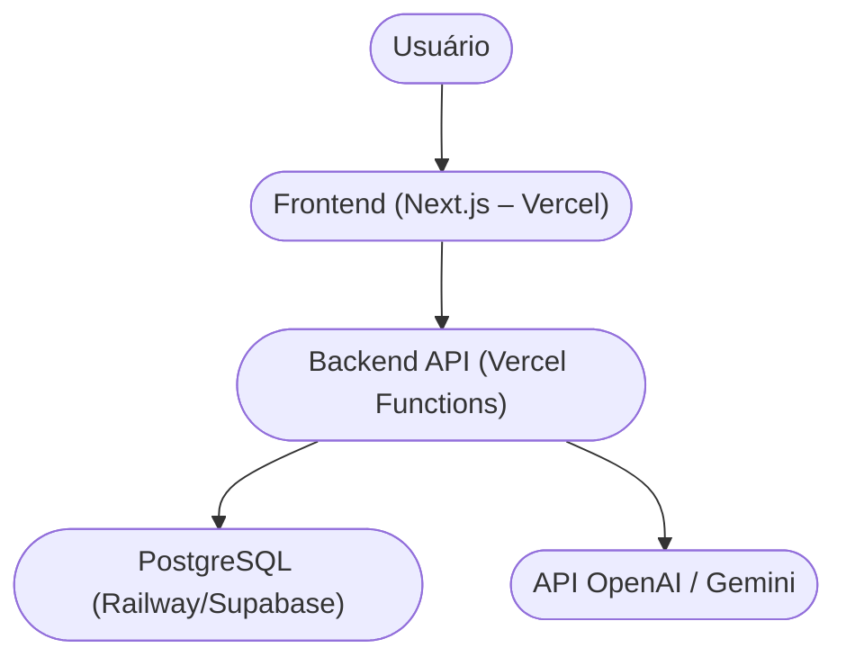

## 🔗 Diagrama C4 — Nível Container

```mermaid
graph TD

%% Contexto
Usuario([Usuário])
Frontend(["Frontend (Next.js – Vercel)"])
Backend(["Backend API (Vercel Functions)"])
DB(["PostgreSQL (Railway/Supabase)"])
OpenAI(["API OpenAI / Gemini"])

Usuario --> Frontend
Frontend --> Backend
Backend --> DB
Backend --> OpenAI
```
