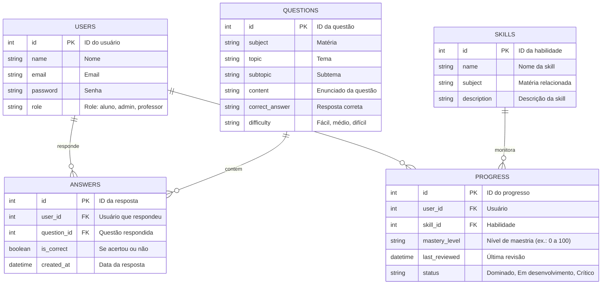

## 🗄️ Diagrama ER — Banco de Dados MentorAI

Este diagrama representa o modelo relacional do banco de dados do MentorIA.  
Ele define como os usuários, questões, respostas, habilidades e progresso estão relacionados.

