## 🗄️ Diagrama ER — Banco de Dados MentorAI

Este diagrama representa o modelo relacional do banco de dados do MentorIA.  
Ele define como os usuários, questões, respostas, habilidades e progresso estão relacionados.

```mermaid
erDiagram
    USERS {
        int id PK "ID do usuário"
        string name "Nome"
        string email "Email"
        string password "Senha"
        string role "Role: aluno, admin, professor"
    }
    QUESTIONS {
        int id PK "ID da questão"
        string subject "Matéria"
        string topic "Tema"
        string subtopic "Subtema"
        string content "Enunciado da questão"
        string correct_answer "Resposta correta"
        string difficulty "Fácil, médio, difícil"
    }
    ANSWERS {
        int id PK "ID da resposta"
        int user_id FK "Usuário que respondeu"
        int question_id FK "Questão respondida"
        boolean is_correct "Se acertou ou não"
        datetime created_at "Data da resposta"
    }
    SKILLS {
        int id PK "ID da habilidade"
        string name "Nome da skill"
        string subject "Matéria relacionada"
        string description "Descrição da skill"
    }
    PROGRESS {
        int id PK "ID do progresso"
        int user_id FK "Usuário"
        int skill_id FK "Habilidade"
        string mastery_level "Nível de maestria (ex.: 0 a 100)"
        datetime last_reviewed "Última revisão"
        string status "Dominado, Em desenvolvimento, Crítico"
    }

    USERS ||--o{ ANSWERS : responde
    QUESTIONS ||--o{ ANSWERS : contem
    USERS ||--o{ PROGRESS : possui
    SKILLS ||--o{ PROGRESS : monitora
```

